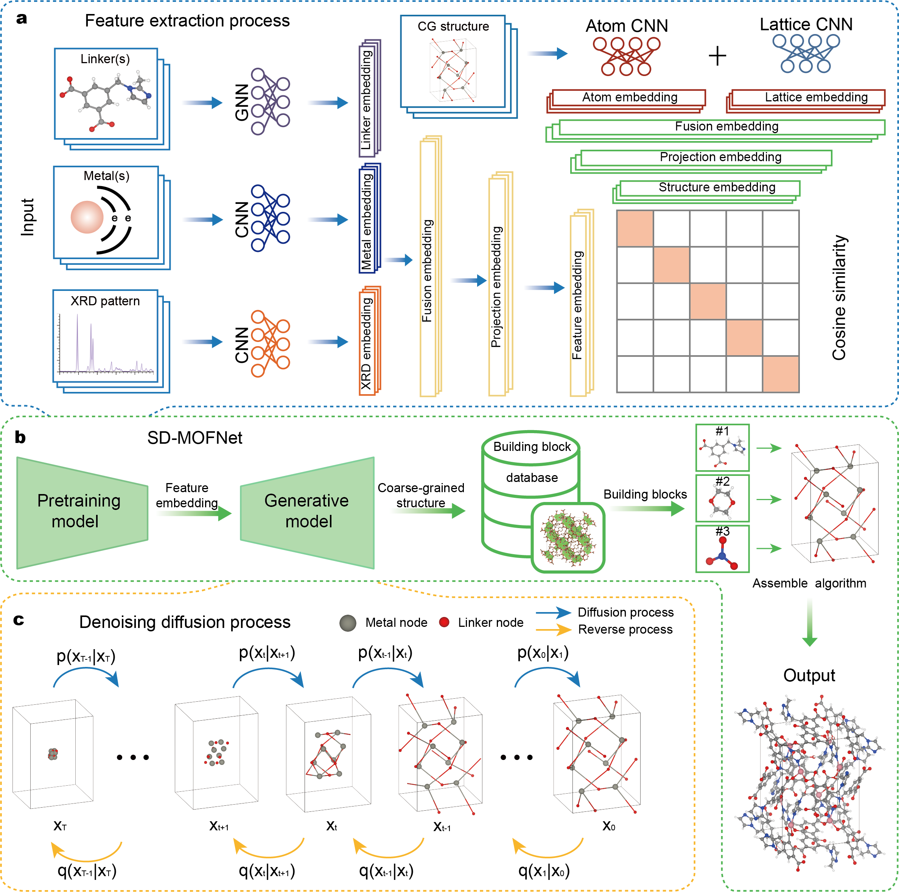

# SD-MOFNet

<div align='center'>
 
<!-- [](https://www.google.com/) -->
[](https://opensource.org/licenses/MIT)

</div>

**Title** - Crystal Structure Prediction for Metal-organic Frameworks from Powder X-Ray Diffraction with Machine Learning

**Authors** - Bin Feng, Bingxu Wang, Linpeng Lv, Hanlin Li, Mingzheng Zhang, Zhefeng Chen, Shunning Li and Feng Pan

---

## Table of Contents

- [SD-MOFNet](#SD-MOFNet)
  - [Table of Contents](#table-of-contents)
  - [Introduction](#introduction)
  - [Model Architecture](#model-architecture)
  - [Getting Started](#getting-started)
    - [Prerequisites](#prerequisites)
    - [Process data](#process-data)
    - [Extract feature](#extract-feature)
    - [Generate CG structure](#generate-CG-structure)
    - [Assemble atomic MOFs](#assemble-atomic-MOFs)
  - [License](#license)
  - [Acknowledgement](#acknowledgement)
  - [Citation](#citation)

---

## Introduction
This work present a crystal structure generation framework based on the Stable Diffusion architecture (SD-MOFNet) designed to enable intelligent, high-throughput interpretation of powder X-ray diffraction (PXRD) patterns and subsequent reconstruction of atomic-level crystal structures for metal–organic frameworks (MOFs). SD-MOFNet leverages pretrained models to extract salient features from PXRD spectra alongside essential prior information, facilitating the generation of structural building-block sites within the unit cell. Using experimental MOF structures from the Cambridge Structural Database (CSD) as the training dataset, and experimentally obtained PXRD patterns as test cases, we demonstrate that SD-MOFNet effectively captures spectral features, integrates physicochemical information from metal nodes and organic linkers, and subsequently generates the critical structural sites necessary for assembling complete atomic structures. By employing a coarse-grained(CG) strategy, SD-MOFNet effectively overcomes the limitations traditionally imposed by atom count in crystal structure prediction (CSP) tasks, thus enabling its broad applicability across diverse MOF domains. The proposed framework offers a novel technological route toward automated structural determination in high-throughput MOF experiments, significantly advancing the application of machine learning methods within analytical and structural chemistry.

> **Keywords**: Metal-organic Frameworks, Crystal Structure Prediction, Powder X-Ray Diffraction, Interpretability.

## Model Architecture
Schematic illustration of the overall SD-MOFNet framework is shown in below.



Further explain the details in the [paper](https://github.com/PKUsam2023/SD-MOFNet), providing context and additional information about the architecture and its components.

## Getting Started

### Prerequisites

The code in this repo has been tested with the following software versions:
- Python>=3.8.5
- torch>=1.13.1
- numpy>=1.24.4
- scikit-learn>=1.3.2
- matplotlib>=3.7.5

The installation can be done quickly with the following statement.
```
pip install -r requirements.txt
```
We recommend using the Anaconda Python distribution, which is available for Windows, MacOS, and Linux. Installation for all required packages (listed above) has been tested using the standard instructions from the providers of each package.

You can download the preprocessed `linker_valence_table` and `valid_bbs_space_408626` database from [Zenodo](https://zenodo.org/records/15745443) (recommended).

To obtain full data, please contact chenwei_wu@stu.pku.edu.cn 

### Process data

Creating your own test dataset. You can according to `create_data/README.md`.

### Extract feature

Extracting your dataset's feature. You can according to `pretrained_model/README.md`.

### Generate CG structure

Generating coarse-grained crystal structures. You can according to `generation_model/README.md`.

### Assemble atomic MOFs

Assembling atomic crystal structures. You can according to `assemble/README.md`.

## License

This project is licensed under the MIT License - see the [LICENSE](LICENSE) file for details.

## Acknowledgement

This codebase is based on several existing repositories:

- [CDVAE](https://github.com/txie-93/cdvae)
- [Open catalyst project](https://github.com/Open-Catalyst-Project/ocp)
- [PyTorch Geometric](https://github.com/pyg-team/pytorch_geometric)
- [PyTorch](https://github.com/pytorch/pytorch)
- [Lightning](https://github.com/Lightning-AI/pytorch-lightning/)
- [Hydra](https://github.com/facebookresearch/hydra)


---

## Citation

If you use this code or the pre-trained models in your work, please cite our work. 
- Bin Feng, Bingxu Wang, Linpeng Lv, Hanlin Li, Mingzheng Zhang, Zhefeng Chen, Shunning Li and Feng Pan. "Crystal Structure Prediction for Metal-organic Frameworks from Powder X-Ray Diffraction with Machine Learning"